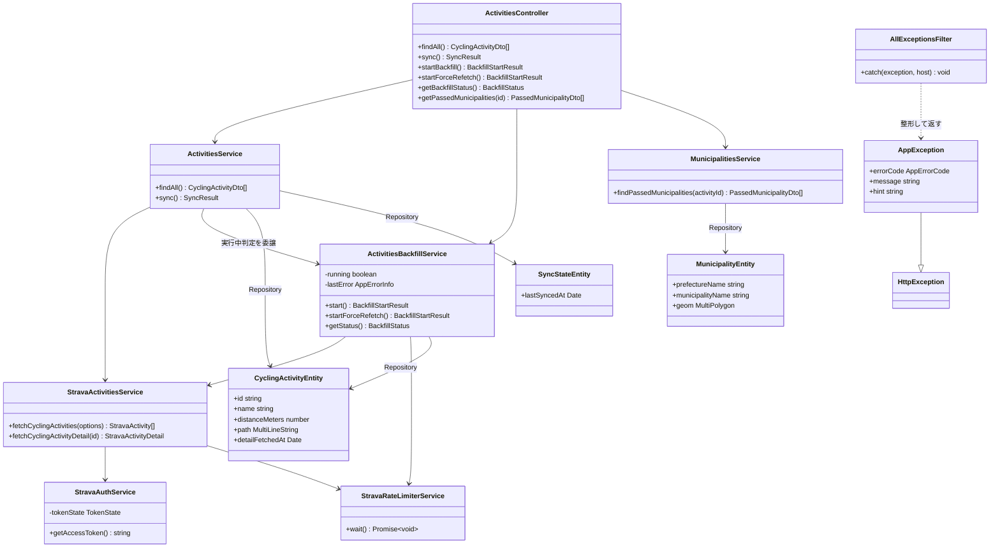
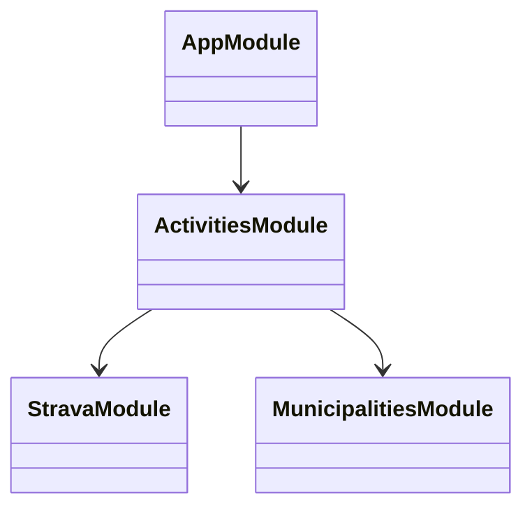
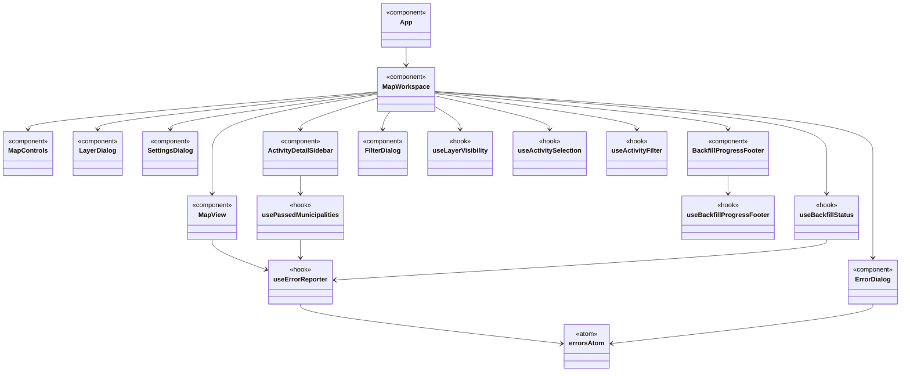

# クラス図（現状の実装）

Issue #29 の対応として、現在の実装（2026-07-14時点、PR #40まで）についてのクラス図と、設計上の改善提案をまとめる。

バックエンド（NestJS、実際のクラス設計）とフロントエンド（React、関数コンポーネント+フック）は設計の性質が異なるため、図を分けて作成した。

## バックエンド

- `toStravaApiException`（`strava-api.exception.ts`）は独立した例外クラスではなく、axiosエラーを`AppException`インスタンスへ変換する純粋関数。`StravaActivitiesService`/`StravaAuthService`はこれをそのままthrowする。
- `cycling-activity-entity.util.ts`（`toPlaceholderCyclingActivityEntity`・`toCyclingActivityEntityFromDetail`）・`cycling-activity-dto.util.ts`（`toCyclingActivityDto`）はクラスを持たない変換関数群で、`CyclingActivityEntity`⇔Strava API⇔DTOの変換をこの層に集約している。

### モジュール依存関係

## フロントエンド

Reactの関数コンポーネント・フックはクラスではないが、依存関係をクラス図の記法で表現する（コンポーネントは`<<component>>`、フックは`<<hook>>`、グローバルステートは`<<atom>>`のステレオタイプを付与）。

- Issue #28（PR #40）でエラー状態を`errorsAtom`によるグローバルステートへ切り出したことで、`MapView`・`ActivityDetailSidebar`・`useBackfillStatus`・`usePassedMunicipalities`は`useErrorReporter`を直接呼び出すのみになり、`onError`のprops経由の受け渡しが無くなった。
- Issue #32で左サイドバー（`LayerSidebar`）を廃止し、地図右下に浮かぶ`MapControls`のアイコンから`LayerDialog`・`FilterDialog`・`SettingsDialog`を開く構成へ変更した。初期取り込み・強制再取得の進捗表示は、設定ダイアログが即座に閉じる仕様になったことに伴い、地図下部の`BackfillProgressFooter`（表示状態を`useBackfillProgressFooter`で管理）へ移した。
- `layerVisibility`・`selectedIds`/`focusedId`・`filter`は、現時点では`MapWorkspace`から直接の子コンポーネントへ渡されるのみで、深いバケツリレーは発生していない。

## 設計上の改善提案

1. **`ActivitiesService`と`ActivitiesBackfillService`の責務の重なり**: 両者とも`StravaActivitiesService`と`CyclingActivityEntity`のRepositoryに直接依存しており、Strava詳細取得→Entity変換→DB保存という同じ手順を（`cycling-activity-entity.util.ts`の共通関数経由とはいえ）別々の場所で呼び出している。今後アクティビティの永続化ロジックが複雑化する場合、両サービスが共通で使う`CyclingActivityRepository`（TypeORMのRepositoryをラップする独自クラス）を切り出し、保存に関する共通処理（重複チェック等）を一本化することを検討する余地がある。現状の規模では過剰設計になる可能性もあり、必須の対応ではない。
2. **`ActivitiesController`が3つのサービスに直接依存している**: `ActivitiesService`・`ActivitiesBackfillService`・`MunicipalitiesService`という異なる関心事（参照/同期・初期取り込み・逆ジオコーディング）を1つのコントローラーが束ねている。現状はエンドポイント数が少なく許容範囲だが、今後エンドポイントが増える場合はコントローラーの分割（例: `MunicipalitiesController`を独立させる）を検討するとよい。
3. **`StravaActivitiesService`/`StravaAuthService`が`HttpService`（axiosの薄いラッパー）に直接依存**: DIP（依存性逆転の原則）の観点では、Strava APIクライアントとしての抽象インターフェースを挟む余地があるが、既存の単体テストは`HttpService`のモックで十分に検証できており、抽象化による実利は現時点では小さいと判断する。将来Strava以外の外部サービス連携（例: Issue #23の写真閲覧機能でのGoogle Photos連携）が増える場合、共通の「外部APIクライアント」抽象を検討する契機になりうる。
4. **フロントエンドの`MapWorkspace`が担う責務の広さ**: レイヤー表示状態・初期取り込み進捗・アクティビティ選択・フィルタ条件と、複数のフックを束ねている。Issue #32（左サイドバー廃止・Map Controlsへの移行）で`LayerDialog`・`SettingsDialog`・`BackfillProgressFooter`という独立したコンポーネントに分割したが、各コンポーネントへの配線（フックの呼び出し・propsの受け渡し）自体は引き続き`MapWorkspace`が担っている。責務の広さそのものの解消（例: Contextやカスタムフックへの集約）は現状の規模では過剰設計になりうるため、追加のフックが増えるタイミングで改めて検討する。
5. **エラーハンドリングの一貫性は良好**: バックエンドは`AllExceptionsFilter`によるレスポンス形式の統一、フロントエンドは`errorsAtom`によるグローバルなエラースタックで一元管理されており、この部分の設計は現状の規模に対して適切と判断する。追加の変更提案は無い。
